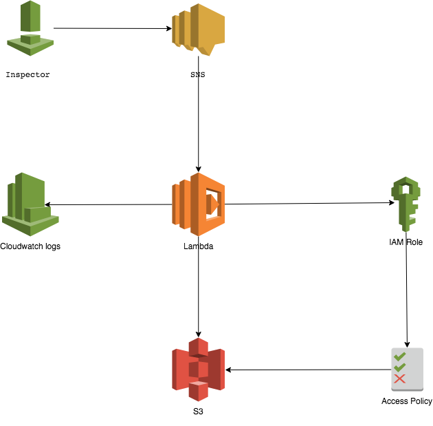

# Inspector | SNS | Lambda | S3 

Push Inspector findings automatically to an S3 bucket after a vulnerability assessment scan has completed.

## Problem:
##### REF: Inspector | SNS | Lambda | SNS

The original configuration had Inspector finding sent as emailed url's via SNS, 
However through deep diving I discovered that the pre-signed url's were only valid for 15min. 
Extending the 15min window is not possible because the url is world readable, 
so the longer it is valid the longer a potential attacker has to download the file before the link expires.

## Getting Started:
 

    1) Create a S3 bucket and attach the bucket policy. 
       You will need to fill out the policy to include your S3 bucket name.
    
    2) Edit the IAM Role attached to your lambda function to include 
       [s3:ListBucket", "s3:GetBucketLocation", "s3:GetObject", "s3:PutObject"]
    
    3) Create a Lambda function in Python3.7 with the following code attached in file "Inspector_Lambda_s3.py". 
       Edit the line 63 which specifies the S3 bucket name.
    
    4) Create a SNS topic with the Lambda Function as subscriber.
    
    5) Once the scan is finished, it will upload the full report and the findings(in .json format) to the S3 bucket.

### SNS Access policy

Once the SNS Topic has been created, Subscribe to it with the "Lambda Function"

    {
      "Version": "2008-10-17",
      "Id": "inspector-sns-publish-policy",
      "Statement": [
        {
          "Sid": "inspector-sns-publish-statement",
          "Effect": "Allow",
          "Principal": {
            "Service": "inspector.amazonaws.com"
          },
          "Action": "SNS:Publish",
          "Resource": "arn:aws:sns:*"
        }
      ]
    }
    
### IAM Role policy

The role needs to be attached to the "Lambda Function"

    {
        "Version": "2012-10-17",
        "Statement": [
            {
                "Effect": "Allow",
                "Action": [
                    "logs:CreateLogGroup",
                    "logs:CreateLogStream",
                    "logs:PutLogEvents"
                ],
                "Resource": "arn:aws:logs:*:*:*"
            },
            {
                "Effect": "Allow",
                "Action": [
                    "inspector:DescribeFindings",
                    "inspector:GetAssessmentReport",
                    "inspector:ListFindings",
                    "SNS:CreateTopic",
                    "SNS:Subscribe",
                    "SNS:ListSubscriptionsByTopic",
                    "SNS:Publish",
                    "s3:ListBucket",
                    "s3:GetBucketLocation",
                    "s3:GetObject",
                    "s3:PutObject"
                ],
                "Resource": "*"
            }
        ]
    }
    
### Lambda function

You need to ensure that you are using python version 3.7. So that lambda is able to handle the "urllib.request" module.
Edit the "line 63" [ Bucket="<YOUR_BUCKET_NAME>" ] which specifies the S3 bucket

##### Required Python Modules

    * AWS boto3
    * json
    * ssl
    
#### Python Code    

    import boto3
    import json
    import re
    import urllib.request
    import ssl
    
    clientInspector = boto3.client('inspector')
    
    # Get Run ARN
    def lambda_handler(event, context):
        records = event["Records"]
        for v in records:
            message = (v["Sns"]["Message"])
            create_dict = json.loads(message)
            run_arn = create_dict.get('run')
        obtain_findings(run_arn=run_arn)
    
    # Upload Inspector findings to s3 bucket
    def obtain_findings(run_arn):
        try:
            run_name = re.sub(r'.+/',"",run_arn)
            paginator = clientInspector.get_paginator('list_findings')
            response_iterator = paginator.paginate(assessmentRunArns=[run_arn])
            for response in response_iterator:
                for k,v in response.items():
                    if k == "findingArns":
                        if v == []:
                            continue
                        else:
                            list_find = (v)
                            for idx,arn in enumerate (list_find):
                                finding_name = re.sub(r'.+/',"",arn)
                                response_describe_finding = clientInspector.describe_findings(findingArns=[arn],locale='EN_US')
                                response_describe_finding = json.dumps(response_describe_finding, indent=4, default=str)
                                object_name = "Assessment_run_"+run_name+"/"+"Finding_"+finding_name+".json"
                                upload_to_bucket(object_s3=response_describe_finding,key_s3=object_name)
                    else:
                        continue
            obtain_report(run_arn=run_arn,run_name=run_name)
        except Exception as error:
            print (error)
    
    def obtain_report(run_arn,run_name):
        try:
            response = clientInspector.get_assessment_report(assessmentRunArn=run_arn,reportFileFormat='HTML',reportType='FULL')
            if response["status"] == "COMPLETED":
                filename = "Report_"+run_name+'.html'
                url = response["url"]
                context = ssl._create_unverified_context()
                report = urllib.request.urlopen(url, context=context)
                report_object = report.read()
                upload_to_bucket(object_s3=report_object,key_s3=filename)
            else:
                obtain_report(run_arn=run_arn,run_name=run_name)
        except Exception as error:
            print (error)
    
    def upload_to_bucket(object_s3,key_s3):
        try:
            clientS3 = boto3.client('s3')
            response = clientS3.put_object(
                Body=object_s3,
                Bucket="<YOUR_BUCKET_NAME>",
                ContentEncoding='json',
                Key=key_s3,
                )
        except Exception as error:
            print (error)

### S3 bucket policy

Create a S3 bucket in order to drop the findings into once lambda has iterated over it.

    {
        "Version": "2012-10-17",
        "Statement": [
            {
                "Effect": "Allow",
                "Principal": {
                    "AWS": "arn:aws:iam::"YOUR ACCOUNT NUMBER":role/service-role/"YOUR IAM ROLE" "
                },
                "Action": [
                    "s3:GetObject",
                    "s3:PutObject",
                    "s3:PutObjectAcl"
                ],
                "Resource": [
                    "arn:aws:s3:::"YOUR BUCKET NAME"/*",
                    "arn:aws:s3:::"YOUR BUCKET NAME" "
                ]
            }
        ]
    }
    
#### TAGS

    AWS | CLOUD | SECURITY | IAM | INSPECTOR | SNS | LAMBDA | S3 | PYTHON | BOTO | FINDINGS  